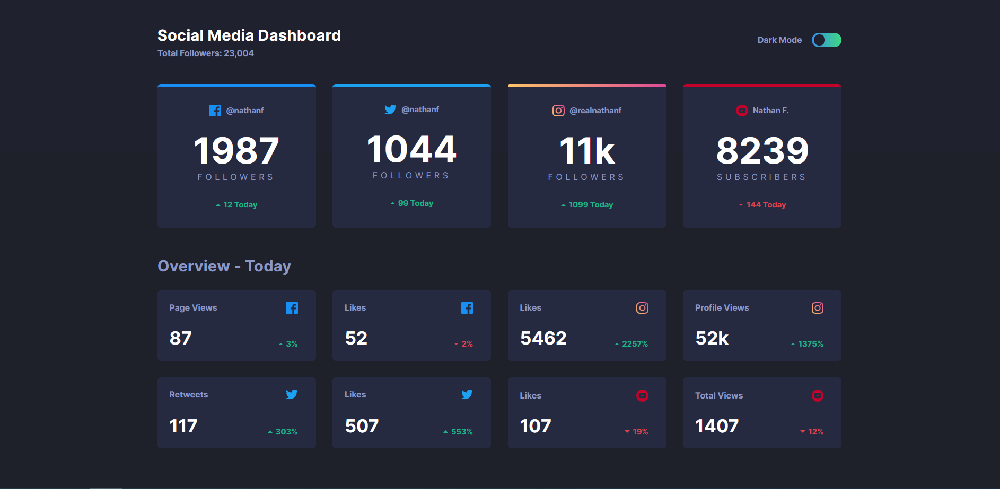
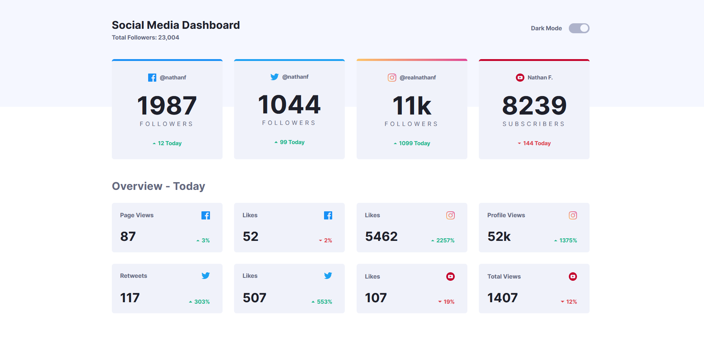

# Frontend Mentor - Social media dashboard with theme switcher solution

This is a solution to the [Social media dashboard with theme switcher challenge on Frontend Mentor](https://www.frontendmentor.io/challenges/social-media-dashboard-with-theme-switcher-6oY8ozp_H). Frontend Mentor challenges help you improve your coding skills by building realistic projects. 

## Table of contents

- [Overview](#overview)
  - [The challenge](#the-challenge)
  - [Screenshot](#screenshot)
  - [Links](#links)
- [My process](#my-process)
  - [Built with](#built-with)
  - [What I learned](#what-i-learned)
  - [Useful resources](#useful-resources)
- [Author](#author)

## Overview

### The challenge

Users should be able to:

- View the optimal layout for the site depending on their device's screen size
- See hover states for all interactive elements on the page
- Toggle color theme to their preference

### Screenshot





### Links

- Solution URL: [https://github.com/by-yee/social-media-dashboard-with-theme](https://github.com/by-yee/social-media-dashboard-with-theme)
- Live Site URL: [https://by-yee.github.io/social-media-dashboard-with-theme/](https://by-yee.github.io/social-media-dashboard-with-theme/)

## My process

### Built with

- Semantic HTML5 markup
- CSS custom properties
- Flexbox
- CSS Grid
- Mobile-first workflow
- Javascript

### What I learned

In the dark mode, when `:hover` the switch(toggle), The word `Dark Mode` is expected to change a lighter color. 
To make it done without using JavaScript, CSS selector is needed. Since CSS only supports styling in cascading direction, not up, I need to change my code from: 

```html
<div class="header__theme">
  <h2 class="header__label">Dark Mode</h2>
  <label class="header__switch">
    <input type="checkbox" class="toggle">
      <span class="header__switch--slider round"></span>
  </label>
</div>
```

to:

```html
<div class="header__theme">
  <label class="header__switch">
    <input type="checkbox" class="toggle">
      <span class="header__switch--slider round"></span>
  </label>
  <h2 class="header__label">Dark Mode</h2>
</div>
```

Re-arrange the `<h2>` tag below the switch. So now the `<label>` is parent while `<h2>` become the child.

The `:hover` result came out pretty well after make changes on adding these lines of css codes:

```css
.header__switch:hover + .header__label {
  color: var(--textTwo);
}
```

Lastly, changed the flex-direction from `row` to `row-reverse` in order to arrange the `<h2>` on the left and `<label>` on the right.

### Useful resources

- [w3schools](https://www.w3schools.com/howto/howto_css_switch.asp) - Useful example for the toggle checkbox.

## Author

- Frontend Mentor - [@by-yee](https://www.frontendmentor.io/profile/by-yee)
